# 🦦🦦 StreamMultiDiffusion 🦦🦦

<p align="center">
  
</p>


## [StreamMultiDiffusion: Real-Time Interactive Generation with Region-Based Semantic Control](https://arxiv.org/abs/2403.09055)
> ##### Authors: [Jaerin Lee](http://jaerinlee.com/), [Daniel Sungho Jung](https://dqj5182.github.io/), [Kanggeon Lee](https://github.com/dlrkdrjs97/), and [Kyoung Mu Lee](https://cv.snu.ac.kr/index.php/~kmlee/)

<p align="center">
    
</p>


<div align="center">

[](https://jaerinlee.com/research/streammultidiffusion)
[](https://arxiv.org/abs/2403.09055)
[](https://github.com/ironjr/StreamMultiDiffusion)
[](https://twitter.com/_ironjr_)
[](https://github.com/ironjr/StreamMultiDiffusion/blob/main/LICENSE)

</div>

<p align="center">
  
</p>

tl;dr: StreamMultiDiffusion is a *real-time* *interactive* *multiple*-text-to-image generation from user-assigned *regional* text prompts.

In other words, **you can now draw ✍️ using brushes 🖌️ that paints *meanings* 🧠 in addition to *colors*** 🌈!

Our paper is mainly about establishing the compatibility between region-based controlling techniques of [MultiDiffusion](https://multidiffusion.github.io/) and acceleration techniques of [LCM](https://latent-consistency-models.github.io/) and [StreamDiffusion](https://github.com/cumulo-autumn/StreamDiffusion).
To our surprise, these works were not compatible before, limiting the possible applications from both branches of works.
The effect of acceleration and stabilization of multiple region-based text-to-image generation technique is demonstrated using [StableDiffusion v1.5](https://huggingface.co/runwayml/stable-diffusion-v1-5) in the video below ⬇️:

https://github.com/ironjr/MagicDraw/assets/12259041/9dda9740-58ba-4a96-b8c1-d40765979bd7

The video means that this project finally lets you work with **large size image generation with fine-grained regional prompt control**.
Previously, this was not feasible at all.
Taking an hour per trial means that you cannot sample multiple times to pick the best generation you want or to tune the generation process to realize your intention.
However, we have decreased the latency **from an hour to a minute**, making the technology workable for creators (hopefully).

---

## ⭐️ Features


| 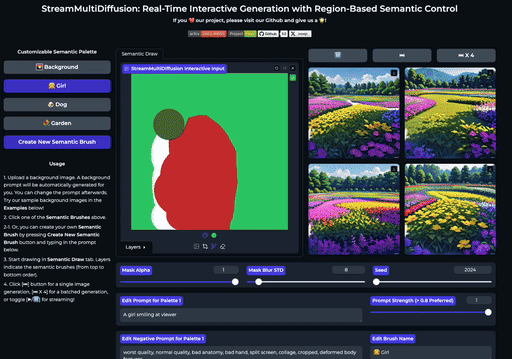 | 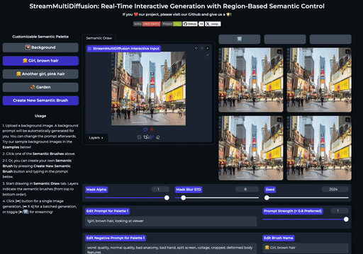 |  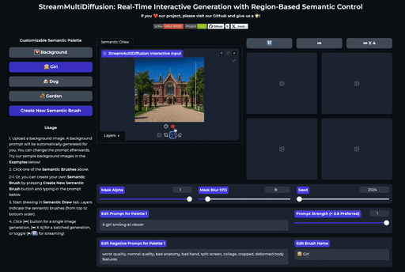  |
| :----------------------------: | :----------------------------: | :----------------------------: |

1. **Interactive image generation from scratch with fine-grained region control.** In other words, you paint images using meainings.

2. **Prompt separation.** Be bothered no more by unintentional content mixing when generating two or more objects at the same time!

3. **Real-time image inpainting and editing.** Basically, you draw upon any uploaded photo or a piece of art you want.

---

## 🤖 Installation

```bash
conda create -n smd python=3.10 && conda activate smd
pip install -r requirements.txt
```

## ⚡ Usage

### Overview

StreamMultiDiffusion is served in three different forms.

1. The main interactive demo powered by Gradio is available at `src/app.py`. Just type the below line in your command prompt and open `https://localhost:8000` with any web browser will launch the app.

```bash
CUDA_VISIBLE_DEVICES=0 python app.py --model {your stable diffusion 1.5 checkpoint} --height 512 --width 512 --port 8000
```

2. Jupyter Lab demos are available in the `notebooks` directory. Simply type `jupyter lab` in the command prompt will open a Jupyter server.

3. Command line prompts by importing the `model` in `src`. For detailed examples and interfaces, please see the Jupyter demos.


### Basic Usage (Python)

The main python modules in our project is two-fold: (1) [`model.StableMultiDiffusionPipeline`](https://github.com/ironjr/StreamMultiDiffusion/blob/main/src/model/stablemultidiffusion_pipeline.py) for single-call generation (might be more preferable for CLI users), and (2) [`model.StreamMultiDiffusion`](https://github.com/ironjr/StreamMultiDiffusion/blob/main/src/model/streammultidiffusion.py) for streaming application such as the [one](https://github.com/ironjr/StreamMultiDiffusion/blob/main/src/app.py) in the main figure of this README page.
We provide minimal examples for the possible applications below.


### Streaming Generation Process

With [multi-prompt stream batch](https://arxiv.org/abs/2403.09055), our modification to the [original stream batch architecture](https://github.com/cumulo-autumn/StreamDiffusion) by [@cumulo_autumn](https://twitter.com/cumulo_autumn), we can stream this multi-prompt text-to-image generation process to generate images for ever.

**Result:**

| 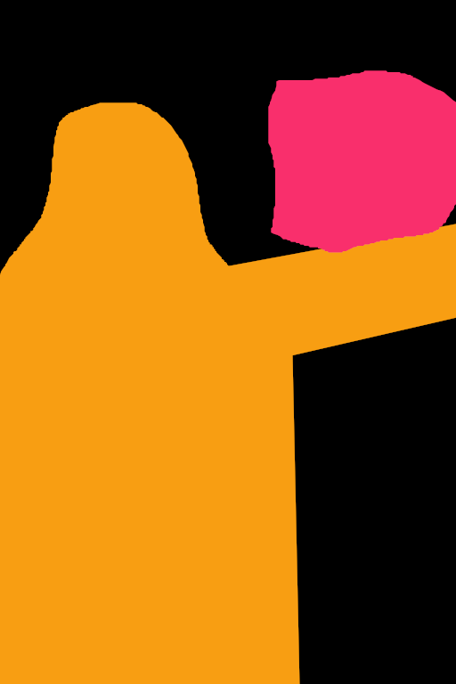 |  |
| :----------------------------: | :----------------------------: |
| Semantic Brush Input | Generated Stream |

**Code:**

```python
import torch
from util import seed_everything, Streamer
from model import StreamMultiDiffusion

# The following packages are imported only for loading the images.
import torchvision.transforms as T
import requests
import time
import imageio # This is not included in our requirements.txt!
from functools import reduce
from io import BytesIO
from PIL import Image


seed = 2024
device = 0
height = 768
width = 512

# Load the module.
device = torch.device(f'cuda:{device}')
smd = StreamMultiDiffusion(
    device,
    hf_key='ironjr/BlazingDriveV11m',
    sd_version='1.5',
    height=height,
    width=width,
    cfg_type='none',
    autoflush=True,
    use_tiny_vae=True,
    mask_type='continuous',
    bootstrap_steps=2,
    bootstrap_mix_steps=1.5,
    seed=seed,
)

# Load the masks.
masks = []
for i in range(1, 3):
    url = f'https://raw.githubusercontent.com/ironjr/StreamMultiDiffusion/main/assets/zeus/prompt_p{i}.png'
    response = requests.get(url)
    mask = Image.open(BytesIO(response.content)).convert('RGBA')
    mask = (T.ToTensor()(mask)[-1:] > 0.5).float()
    masks.append(mask)
# In this example, background is simply set as non-marked regions.
background = reduce(torch.logical_and, [m == 0 for m in masks])

# Register a background, prompts, and masks (this can be called multiple times).
smd.update_background(Image.new(size=(width, height), mode='RGB', color=(255, 255, 255)))
smd.update_single_layer(
    idx=0,
    prompt='a photo of Mount Olympus',
    negative_prompt='worst quality, bad quality, normal quality, cropped, framed',
    mask=background,
    mask_strength=1.0,
    mask_std=0.0,
    prompt_strength=1.0,
)
smd.update_single_layer(
    idx=1,
    prompt='1girl, looking at viewer, lifts arm, smile, happy, Greek goddess Athena',
    negative_prompt='worst quality, bad quality, normal quality, cropped, framed',
    mask=masks[0],
    mask_strength=1.0,
    mask_std=0.0,
    prompt_strength=1.0,
)
smd.update_single_layer(
    idx=2,
    prompt='a small, sitting owl',
    negative_prompt='worst quality, bad quality, normal quality, cropped, framed',
    mask=masks[1],
    mask_strength=1.0,
    mask_std=0.0,
    prompt_strength=1.0,
)


# Generate images... forever.
# while True:
#     image = smd()
#     image.save(f'{str(int(time.time() % 100000))}.png') # This will take up your hard drive pretty much soon.
#     display(image) # If `from IPython.display import display` is called.
#
#     You can also intercept the process in the middle of the generation by updating other background, prompts or masks.
#     smd.update_single_layer(
#         idx=2,
#         prompt='a small, sitting owl',
#         negative_prompt='worst quality, bad quality, normal quality, cropped, framed',
#         mask=masks[1],
#         mask_strength=1.0,
#         mask_std=0.0,
#         prompt_strength=1.0,
#     )

# Or make a video/gif from your generation stream (requires `imageio`)
frames = []
for _ in range(50):
    image = smd()
    frames.append(image)
imageio.mimsave('my_beautiful_creation.gif', frames, loop=0)
```

---

### Region-Based Multi-Text-to-Image Generation

We support arbitrary-sized image generation from arbitrary number of prompt-mask pairs.
The first example is a simple example of generation 
Notice that **our generation results also obeys strict prompt separation**.


**Result:**

|  | 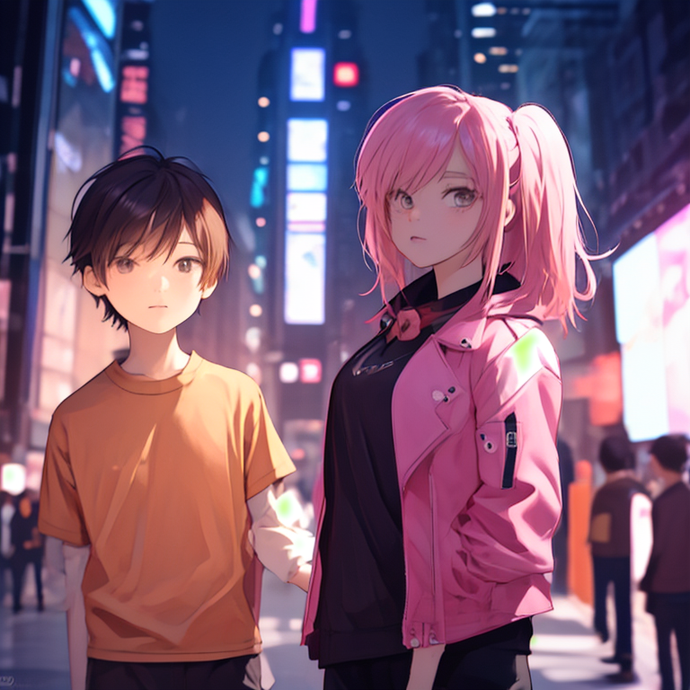 |
| :----------------------------: | :----------------------------: |
| Semantic Brush Input | Generated Image (10 sec) |

<p align="center">
    No more unwanted prompt mixing! Brown boy and pink girl generated simultaneously without a problem.
</p>

**Code:**

```python
import torch
from model import StableMultiDiffusionPipeline
from util import seed_everything

# The following packages are imported only for loading the images.
import torchvision.transforms as T
import requests
from functools import reduce
from io import BytesIO
from PIL import Image


seed = 2024
device = 0

# Load the module.
seed_everything(seed)
device = torch.device(f'cuda:{device}')
smd = StableMultiDiffusionPipeline(
    device,
    hf_key='ironjr/BlazingDriveV11m',
    sd_version='1.5',
)

# Load prompts.
prompts = [
    # Background prompt.
    '1girl, 1boy, times square',
    # Foreground prompts.
    '1boy, looking at viewer, brown hair, casual shirt',
    '1girl, looking at viewer, pink hair, leather jacket',
]
negative_prompts = [
    '',
    '1girl', # (Optional) The first prompt is a boy so we don't want a girl.
    '1boy', # (Optional) The first prompt is a girl so we don't want a boy.
]
negative_prompt_prefix = 'worst quality, bad quality, normal quality, cropped, framed'
negative_prompts = [negative_prompt_prefix + ', ' + p for p in negative_prompts]

# Load masks.
masks = []
for i in range(1, 3):
    url = f'https://raw.githubusercontent.com/ironjr/StreamMultiDiffusion/main/assets/timessquare/timessquare_{i}.png'
    response = requests.get(url)
    mask = Image.open(BytesIO(response.content)).convert('RGBA')
    mask = (T.ToTensor()(mask)[-1:] > 0.5).float()
    masks.append(mask)
# In this example, background is simply set as non-marked regions.
background = reduce(torch.logical_and, [m == 0 for m in masks])
masks = torch.stack([background] + masks, dim=0).float()

height, width = masks.shape[-2:] # (768, 768) in this example.

# Sample an image.
image = smd(
    prompts,
    negative_prompts,
    masks=masks,
    mask_strengths=1,
    mask_stds=0,
    height=height,
    width=width,
    bootstrap_steps=2,
)
image.save('my_beautiful_creation.png')
```

---

### *Larger* Region-Based Multi-Text-to-Image Generation

The below code reproduces the results in the [second video](https://github.com/ironjr/MagicDraw/assets/12259041/9dda9740-58ba-4a96-b8c1-d40765979bd7) of this README page.
The original MultiDiffusion pipeline using 50 step DDIM sampler takes roughly an hour to run the code, but we have reduced in down to **a minute**.

**Result:**

| 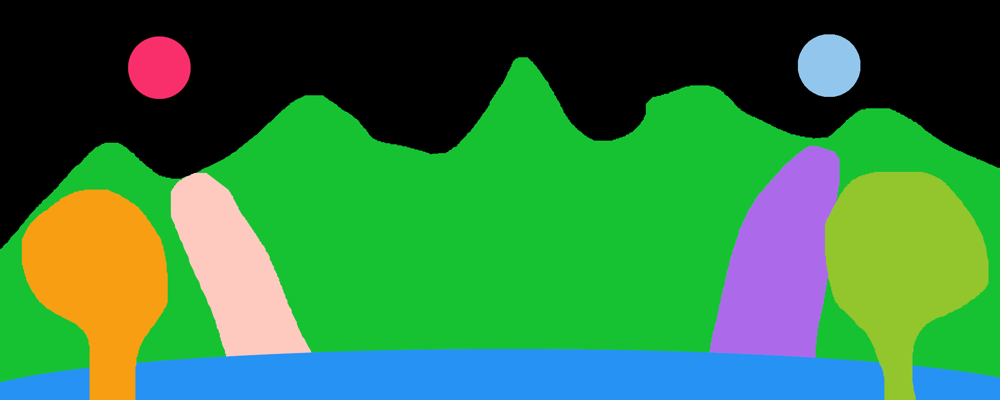 |
| :----------------------------: |
| Semantic Brush Input |
|  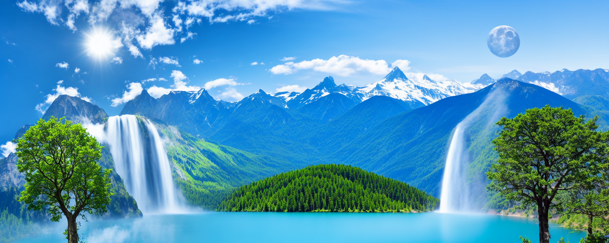 |
| Generated Image (59 sec) |

**Code:**

```python
import torch
from model import StableMultiDiffusionPipeline
from util import seed_everything

# The following packages are imported only for loading the images.
import torchvision.transforms as T
import requests
from functools import reduce
from io import BytesIO
from PIL import Image


seed = 2024
device = 0

# Load the module.
seed_everything(seed)
device = torch.device(f'cuda:{device}')
smd = StableMultiDiffusionPipeline(device)

# Load prompts.
prompts = [
    # Background prompt.
    'clear deep blue sky',
    # Foreground prompts.
    'summer mountains',
    'the sun',
    'the moon',
    'a giant waterfall',
    'a giant waterfall',
    'clean deep blue lake',
    'a large tree',
    'a large tree',
]
negative_prompts = ['worst quality, bad quality, normal quality, cropped, framed'] * len(prompts)

# Load masks.
masks = []
for i in range(1, 9):
    url = f'https://raw.githubusercontent.com/ironjr/StreamMultiDiffusion/main/assets/irworobongdo/irworobongdo_{i}.png'
    response = requests.get(url)
    mask = Image.open(BytesIO(response.content)).convert('RGBA')
    mask = (T.ToTensor()(mask)[-1:] > 0.5).float()
    masks.append(mask)
# In this example, background is simply set as non-marked regions.
background = reduce(torch.logical_and, [m == 0 for m in masks])
masks = torch.stack([background] + masks, dim=0).float()

height, width = masks.shape[-2:] # (768, 1920) in this example.

# Sample an image.
image = smd(
    prompts,
    negative_prompts,
    masks=masks,
    mask_strengths=1,
    mask_stds=0,
    height=height,
    width=width,
    bootstrap_steps=2,
)
image.save('my_beautiful_creation.png')
```

---

### Image Inpainting with Prompt Separation

Our pipeline also enables editing and inpainting existing images.
We also support *any* SD 1.5 checkpoint models.
One exceptional advantage of ours is that we provide an easy separation of prompt
You can additionally trade-off between prompt separation and overall harmonization by changing the argument `bootstrap_steps` from 0 (full mixing) to 5 (full separation).
We recommend `1-3`.
The following code is a minimal example of performing prompt separated multi-prompt image inpainting using our pipeline on a custom model.

**Result:**

| 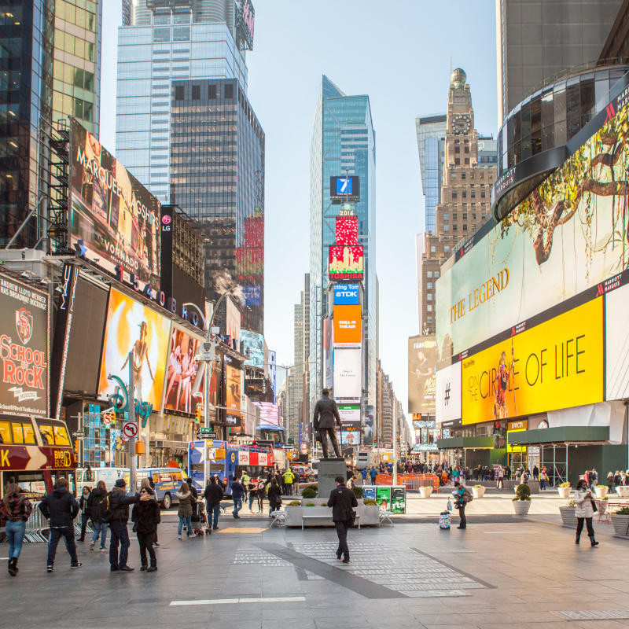 |  | 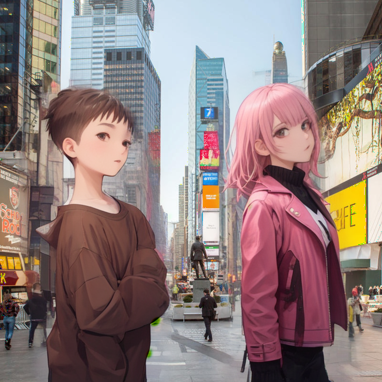 |
| :----------------------------: | :----------------------------: | :----------------------------: |
| Images to Inpaint | Semantic Brush Input | Inpainted Image (9 sec) |

**Code:**

```python
import torch
from model import StableMultiDiffusionPipeline
from util import seed_everything

# The following packages are imported only for loading the images.
import torchvision.transforms as T
import requests
from io import BytesIO
from PIL import Image


seed = 2
device = 0

# Load the module.
seed_everything(seed)
device = torch.device(f'cuda:{device}')
smd = StableMultiDiffusionPipeline(
    device,
    hf_key='ironjr/BlazingDriveV11m',
    sd_version='1.5',
)

# Load the background image you want to start drawing.
#   Although it works for any image, we recommend to use background that is generated
#   or at least modified by the same checkpoint model (e.g., preparing it by passing
#   it to the same checkpoint for an image-to-image pipeline with denoising_strength 0.2)
#   for the maximally harmonized results!
#   However, in this example, we choose to use a real-world image for the demo.
url = f'https://raw.githubusercontent.com/ironjr/StreamMultiDiffusion/main/assets/timessquare/timessquare.jpeg'
response = requests.get(url)
background_image = Image.open(BytesIO(response.content)).convert('RGB')

# Load prompts and background prompts (explicitly).
background_prompt = '1girl, 1boy, times square'
prompts = [
    # Foreground prompts.
    '1boy, looking at viewer, brown hair, casual shirt',
    '1girl, looking at viewer, pink hair, leather jacket',
]
negative_prompts = [
    '1girl',
    '1boy',
]
negative_prompt_prefix = 'worst quality, bad quality, normal quality, cropped, framed'
negative_prompts = [negative_prompt_prefix + ', ' + p for p in negative_prompts]
background_negative_prompt = negative_prompt_prefix

# Load masks.
masks = []
for i in range(1, 3):
    url = f'https://raw.githubusercontent.com/ironjr/StreamMultiDiffusion/main/assets/timessquare/timessquare_{i}.png'
    response = requests.get(url)
    mask = Image.open(BytesIO(response.content)).convert('RGBA')
    mask = (T.ToTensor()(mask)[-1:] > 0.5).float()
    masks.append(mask)
masks = torch.stack(masks, dim=0).float()
height, width = masks.shape[-2:] # (768, 768) in this example.

# Sample an image.
image = smd(
    prompts,
    negative_prompts,
    masks=masks,
    mask_strengths=1,
    # Use larger standard deviation to harmonize the inpainting result (Recommended: 8-32)!
    mask_stds=16.0,
    height=height,
    width=width,
    bootstrap_steps=2,
    bootstrap_leak_sensitivity=0.1,
    # This is for providing the image input.
    background=background_image,
    background_prompt=background_prompt,
    background_negative_prompt=background_negative_prompt,
)
image.save('my_beautiful_inpainting.png')
```

---

### Panorama Generation

Our [`model.StableMultiDiffusionPipeline`](https://github.com/ironjr/StreamMultiDiffusion/blob/main/src/model/stablemultidiffusion_pipeline.py) supports x10 faster generation of irregularly large size images such as panoramas.
For example, the following code runs in 10s with a single 2080 Ti GPU.

**Result:**

<p align="center">
  
</p>
<p align="center">
    512x3072 image generated in 10 seconds.
</p>

**Code:**

```python
import torch
from model import StableMultiDiffusionPipeline

device = 0

# Load the module.
device = torch.device(f'cuda:{device}')
smd = StableMultiDiffusionPipeline(device)

# Sample a panorama image.
smd.sample_panorama('A photo of Alps', height=512, width=3072)
image.save('my_panorama_creation.png')
```

---

### Basic StableDiffusion

We also support standard single-prompt single-tile sampling of StableDiffusion checkpoint for completeness.
This behaves exactly the same as calling [`diffuser`](https://huggingface.co/docs/diffusers/en/index)'s [`StableDiffusionPipeline`](https://github.com/huggingface/diffusers/blob/main/src/diffusers/pipelines/stable_diffusion/pipeline_stable_diffusion.py).

**Result:**

<p align="left">
  
</p>

**Code:**

```python
import torch
from model import StableMultiDiffusionPipeline

device = 0

# Load the module.
device = torch.device(f'cuda:{device}')
smd = StableMultiDiffusionPipeline(device)

# Sample an image.
image = smd.sample('A photo of the dolomites')
image.save('my_creation.png')
```

---

### Basic Usage (GUI)

| 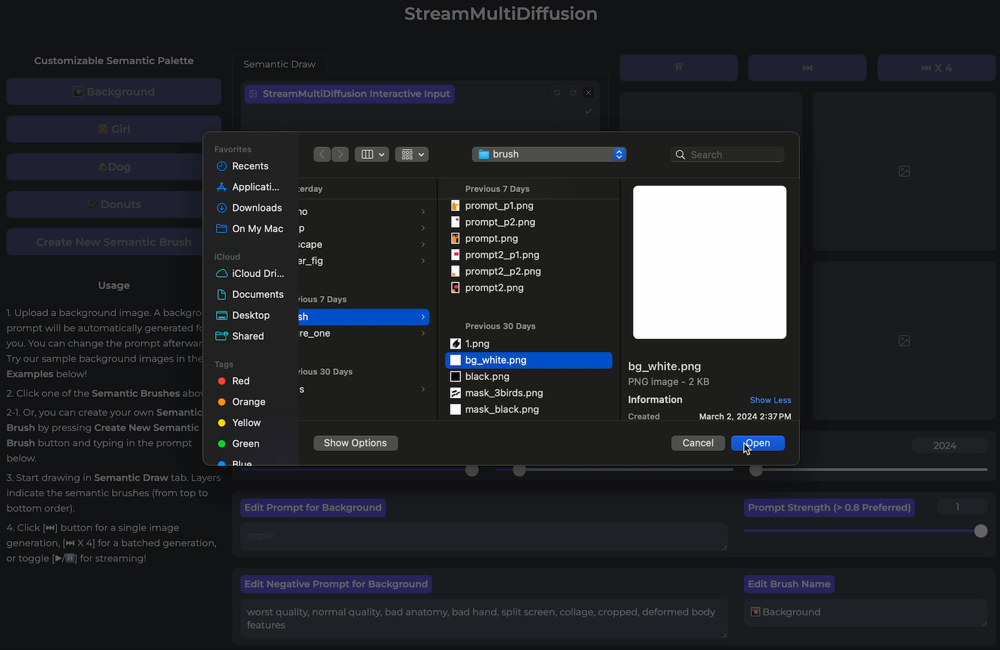 | 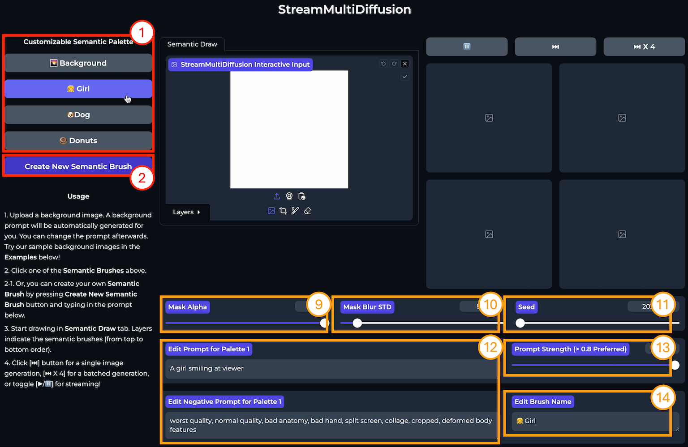 |
| :----------------------------: | :----------------------------: |
| Upoad a background image | Type some text prompts |
| 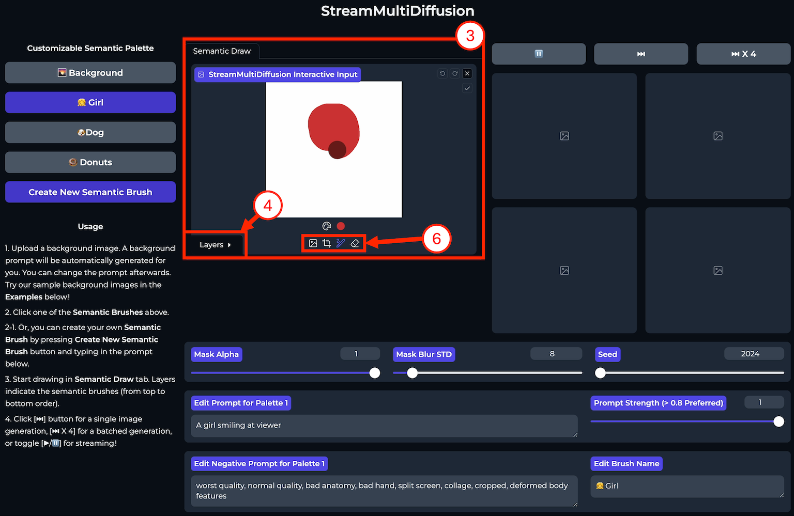 |  |
| Draw | Press the play button and enjoy 🤩 |

1. (top-left) **Upload a background image.** You can start with a white background image, as well as any other images from your phone camera or other AI-generated artworks. You can also entirely cover the image editor with specific semantic brush to draw background image simultaneously from the text prompt.

2. (top-right) **Type some text prompts.** Click each semantic brush on the semantic palette on the left of the screen and type in text prompts in the interface below. This will create a new semantic brush for you.

3. (bottom-left) **Draw.** Select appropriate layer (*important*) that matches the order of the semantic palette. That is, ***Layer n*** corresponds to ***Prompt n***. I am not perfectly satisfied with the interface of the drawing interface. Importing professional Javascript-based online drawing tools instead of the default `gr.ImageEditor` will enable more responsive interface. We have released our code with MIT License, so please feel free to fork this repo and build a better user interface upon it. 😁

4. (bottom-right) **Press the play button and enjoy!** The buttons literally mean 'toggle stream/run single/run batch (4)'.


### Basic Usage (CLI)

Coming Soon!


---


## 💼 Further Information

We have provided detailed explanation of the application design and the expected usages in appendices of our [paper](https://arxiv.org/abs/2403.09055).
This section is a summary of its contents.
Although we expect everything to work fine, there may be unexpected bugs or missed features in the implementation.
We are always welcoming issues and pull requests from you to improve this project! 🤗


### User Interface (GUI)

<p align="center">
  
</p>

| No. | Component Name | Description |
| --- | -------------- | ----------- |
| 1 | *Semantic palette* | Creates and manages text prompt-mask pairs, a.k.a., _semantic brushes_. |
| 2 | Create new _semantic brush_ btn. | Creates a new text prompt-mask pair. |
| 3 | Main drawing pad | User draws at each semantic layers with a brush tool. |
| 4 | Layer selection | Each layer corresponds to each of the prompt mask in the *semantic palette*. |
| 5 | Background image upload | User uploads background image to start drawing. |
| 6 | Drawing tools | Using brushes and erasers to interactively edit the prompt masks. |
| 7 | Play button | Switches between streaming/step-by-step mode. |
| 8 | Display | Generated images are streamed through this component. |
| 9 | Mask alpha control | Changes the mask alpha value before quantization. Controls local content blending (simply means that you can use nonbinary masks for fine-grained controls), but extremely sensitive. Recommended: >0.95 |
| 10 | Mask blur std. dev. control | Changes the standard deviation of the quantized mask of the current semantic brush. Less sensitive than mask alpha control. |
| 11 | Seed control | Changes the seed of the application. May not be needed, since we generate infinite stream of images. |
| 12 | Prompt edit | User can interactively change the positive/negative prompts at need. |
| 13 | Prompt strength control | Prompt embedding mix ratio between the current & the background. Helps global content blending. Recommended: >0.75 |
| 14 | Brush name edit | Adds convenience by changing the name of the brush. Does not affect the generation. Just for preference. |

### Demo Application Architecture

There are two types of transaction data between the front-end and the back-end (`model.streammultidiffusion_pipeline.StreamMultiDiffusion`) of the application: a (1) background image object and a (2) list of text prompt-mask pairs.
We choose to call a pair of the latter as a _semantic brush_.
Despite its fancy name, a _semantic brush_ is just a pair of a text prompt and a regional mask assigned to the prompt, possibly with additional mask-controlling parameters.
Users interact with the application by registering and updating these two types of data to control the image generation stream.
The interface is summarized in the image below ⬇️:

<p align="center">
  
</p>


---

## 🚩 **Updates**

- 🏃 Working on project page and public demo
- ✅ March 16, 2023: Added examples and instructions for region-based generation, panorama generation, and inpainting.
- ✅ March 15, 2023: Added detailed instructions in this README for creators.
- ✅ March 14, 2023: We have released our paper, StreamMultiDiffusion on [arXiv](https://arxiv.org/abs/2403.09055).
- ✅ March 13, 2023: Code release!


## 🙋 FAQ

### What is _Semantic Palette_ Anyway?

**Semantic palette** basically means that you paint things with semantics, i.e., text prompts, just like how you may use brush tools in commercial image editing software, such as Adobe Photoshop, etc.
Our acceleration technique for region-based controlled image generation allows users to edit their prompt masks similarly to drawing.
We couldn't find a good preexisting name for this type of user interface, so we named it as _semantic palette_, hoping for it to make sense to you. 😄


## 🌏 Citation

Please cite us if you find our project useful!

```latex
@article{lee2024streammultidiffusion,
    title={{StreamMultiDiffusion:} Real-Time Interactive Generation with Region-Based Semantic Control},
    author={Lee, Jaerin and Jung, Daniel Sungho and Lee, Kanggeon and Lee, Kyoung Mu},
    journal={arXiv preprint arXiv:2403.09055},
    year={2024}
}
```


## 🤗 Acknowledgement

Our code is based on the projects: [StreamDiffusion](https://github.com/cumulo-autumn/StreamDiffusion), [MultiDiffusion](https://multidiffusion.github.io/), and [Latent Consistency Model](https://latent-consistency-models.github.io/). Thank you for sharing such amazing works!
We also give our huge thanks to [@br_d](https://twitter.com/br_d) and [@KBlueleaf](https://twitter.com/KBlueleaf) for the wonderful models [BlazingDriveV11m](https://civitai.com/models/121083?modelVersionId=236210) and [Kohaku V2](https://civitai.com/models/136268/kohaku-v2)!


## 📧 Contact

If you have any questions, please email `jarin.lee@gmail.com`.
